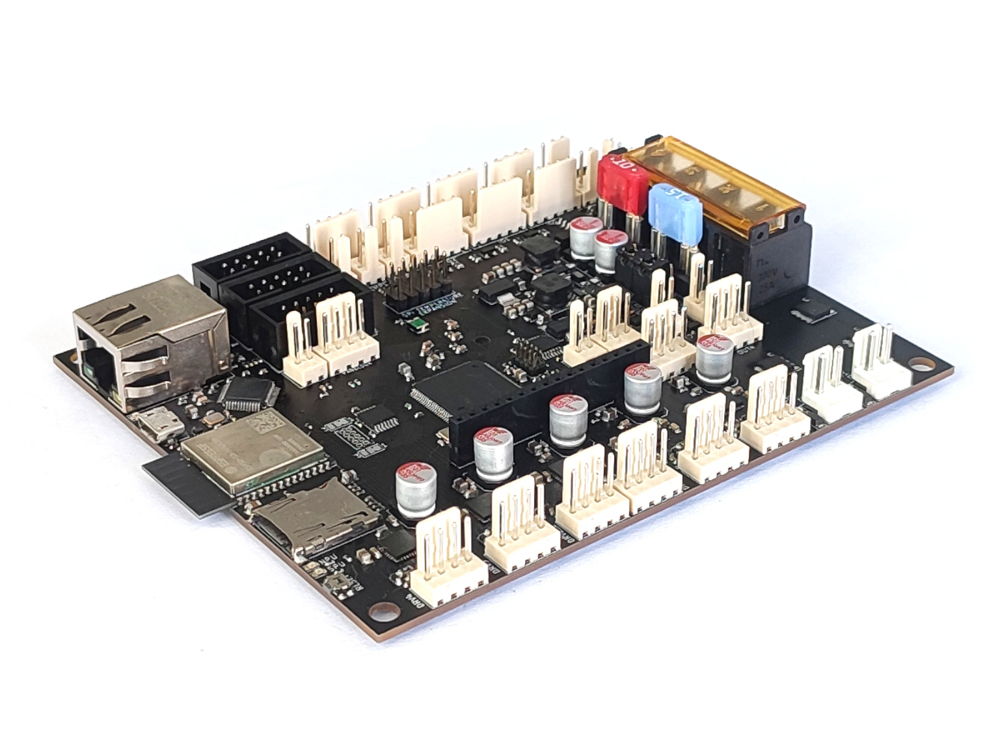

# Phi Mainboard 5LC

### [Currently crowdfunding on Crowd Supply](https://www.crowdsupply.com/likhalabs/phi-mainboard-5lc)

Phi Mainboard 5LC is a 3D printer controller with a focus on network connectivity. In addition to all the things that other controller boards can do, Phi provides a web interface that you can use to interact with your printer over the local network. With Phi, you no longer need a separate single-board computer (like a Raspberry Pi), which saves you money, simplifies setup, and spares you from long start-up times.

While Phi’s feature set is geared toward 3D printers, it can also be used to drive other digital-fabrication equipment, such as CNC machines.

Hardware design files (schematics and layout) for Phi will be uploaded to this repository shortly after the board ships to backers. Documentation will be added over the course of delivery on the [project wiki page](https://github.com/LikhaLabs/Phi-Mainboard-5LC/wiki).